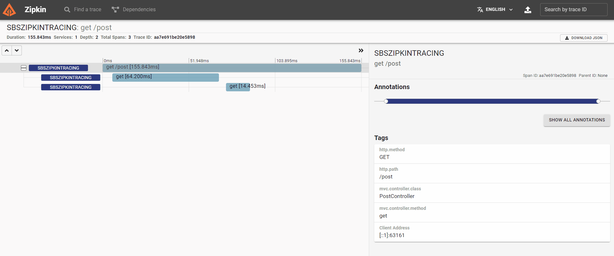
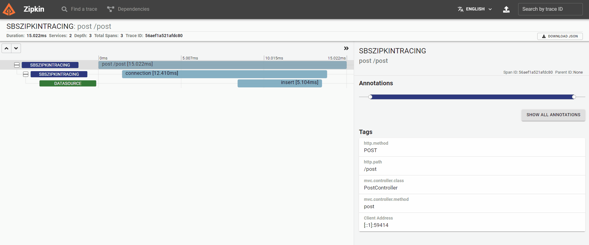
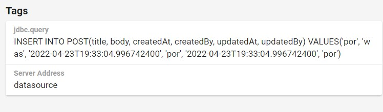
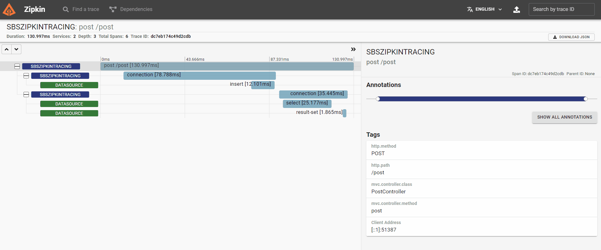
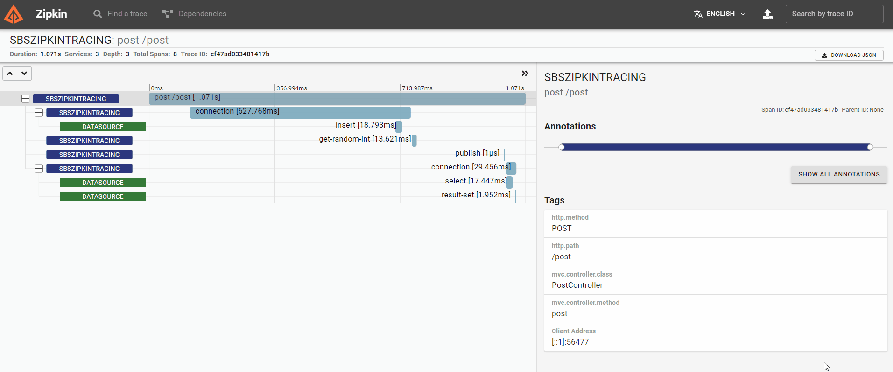
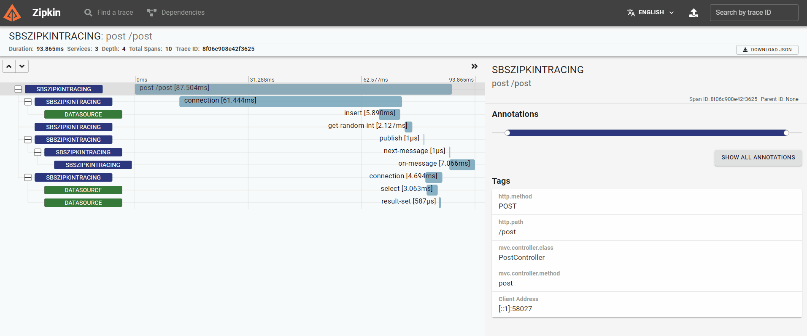
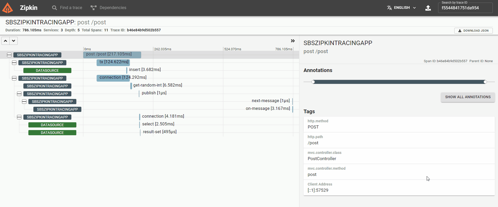
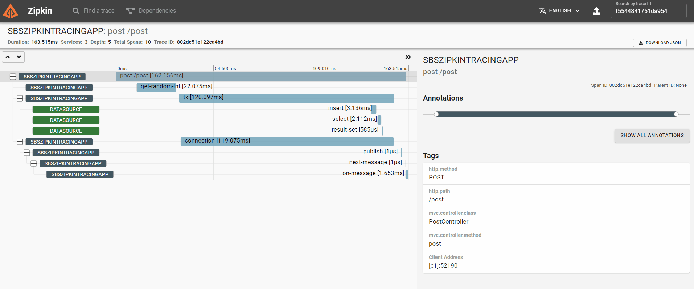
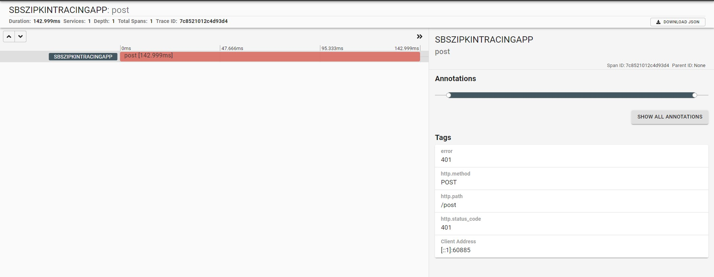
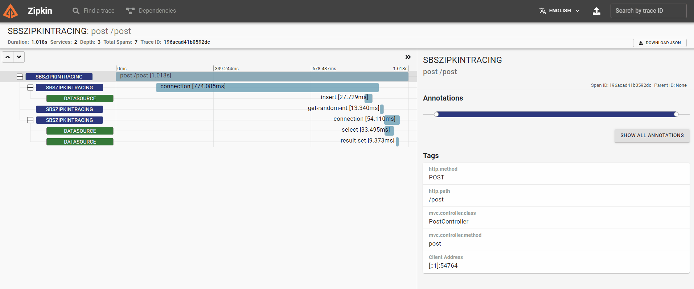

# Spring Boot Sleuth Zipkin Tracing

This project showcase how to do distributed tracing using [Spring Cloud Sleuth](https://spring.io/projects/spring-cloud-sleuth) together with [Zipkin](https://zipkin.io/)

## Initialize project

[via start.spring.io](https://start.spring.io/#!type=gradle-project&language=java&platformVersion=2.6.7&packaging=jar&jvmVersion=17&groupId=com.bwgjoseph&artifactId=spring-boot-sleuth-zipkin-tracing&name=spring-boot-sleuth-zipkin-tracing&description=Spring%20Boot%20Sleuth%20Zipkin%20Tracing&packageName=com.bwgjoseph.spring-boot-sleuth-zipkin-tracing&dependencies=devtools,lombok,configuration-processor,web,cloud-starter-sleuth,actuator,cloud-starter-zipkin)

## Setup Zipkin

See `/docker/docker-compose.yml`

- Navigate to `/docker`
- Run `docker-compose up -d`
- Go to `http://localhost:9411`

## Start Application

When application is first started, you will notice something extra on the log itself

```log
2022-04-23 15:29:24.301  INFO [,,] 24612 --- [  restartedMain] SpringBootSleuthZipkinTracingApplication : Started SpringBootSleuthZipkinTracingApplication in 6.692 seconds (JVM running for 113.005)
```

Noticed the `[,,]` after `INFO`? That is added by `spring-cloud-sleuth` to display `[application name,trace id, span id]`. In order for `application name` to be shown, we need to add `spring.application.name` in `application.properties`

```properties
spring.application.name=sbszipkintracing
```

And when you restart the application, the log will be display as

```log
2022-04-23 15:30:52.204  INFO [sbszipkintracing,,] 24612 --- [  restartedMain] SpringBootSleuthZipkinTracingApplication : Started SpringBootSleuthZipkinTracingApplication in 5.236 seconds (JVM running for 200.909)
```

But because we haven't triggered any request yet, hence, there will not be any `trace/span id`

## Zipkin Configuration

The list of `Zipkin` configuration can be found in [here](https://docs.spring.io/spring-cloud-sleuth/docs/current/reference/htmlsingle/spring-cloud-sleuth.html#common-application-properties)

A few key ones to take note are

```properties
spring.zipkin.service.name=sbszipkintracingapp
spring.zipkin.baseUrl=localhost:9411
spring.zipkin.sender.type=web
```

We only focus on the set that affects how the span are sent to [Zipkin](https://docs.spring.io/spring-cloud-sleuth/docs/current/reference/htmlsingle/spring-cloud-sleuth.html#features-zipkin)

### spring.zipkin.baseUrl

The default url would be configured to `http://localhost:9411/` and as such, there is no need to configure it when testing locally (with default setup), but if you use a different port, or want to send your span to hosted `Zipkin` service, you would need to update this config

### spring.zipkin.sender.type

Span can be sent via `HTTP` or `Messaging` (Kafka, RabbitMQ, ActiveMQ) so this config allow you to configure that. Note that in the docs, it mentioned that if you have `spring-rabbit` in your classpath, you would have to choose between `web` or `rabbitmq` as the sender type but in my case, even when I have `rabbitmq` in the classpath, I did not have to specify in the `application.properties` and it seem that the default is `web`

> I tried to switch to use rabbit but was unable to make it work even after adding `spring.zipkin.rabbitmq.queue`

With further test trial, you would need to configure at least the following config

```properties
spring.zipkin.sender.type=rabbit
spring.zipkin.rabbitmq.addresses=http://localhost:5672/
spring.zipkin.rabbitmq.queue=zipkinrabbit
```

For it to report a failure due to configuration

```log
2022-04-25 12:21:26.275  WARN [sbszipkintracingrabbitapp,,] 8340 --- [=zipkinrabbit}}] z.r.AsyncReporter$BoundedAsyncReporter   : Spans were dropped due to exceptions. All subsequent errors will be logged at FINE level.
2022-04-25 12:21:26.283  WARN [sbszipkintracingrabbitapp,,] 8340 --- [=zipkinrabbit}}] z.r.AsyncReporter$BoundedAsyncReporter   : Dropped 10 spans due to RuntimeException(Unable to establish connection to RabbitMQ server)

java.lang.RuntimeException: Unable to establish connection to RabbitMQ server
Caused by: java.net.UnknownHostException: No such host is known (http)
```

### spring.zipkin.service.name

The service name identified by `Zipkin` can be overwritten via `spring.zipkin.service.name` property. If you defined both `spring.application.name` and `spring.zipkin.service.name`, the latter will take precedent

```log
2022-04-25 11:25:47.893  INFO [sbszipkintracing2,,] 14320 --- [  restartedMain] SpringBootSleuthZipkinTracingApplication : Started SpringBootSleuthZipkinTracingApplication in 13.119 seconds (JVM running for 17.413)
```

## Add Controller

In order to see the `trace/span id` in action, let's create [PostController](/src/main/java/com/bwgjoseph/springbootsleuthzipkintracing/PostController.java) to allow for `REST API` call. Once created, we can trigger a `GET` call via

```sh
curl -k localhost:8080/post
```

And the log will now display as

```log
2022-04-23 15:37:55.043  INFO [sbszipkintracing,4695b333247539ae,4695b333247539ae] 24612 --- [nio-8080-exec-1] o.s.web.servlet.DispatcherServlet
   : Completed initialization in 1 ms
```

Where we will now see `[application name, trace id, span id]`

## View in Zipkin

Let's see how it looks like in the [UI](http://localhost:9411/zipkin/)


Isn't it awesome? It only takes us a few setup and configuration and everything is nicely integrated

## Tracing with RestTemplate

In order to ensure it work with [RestTemplate](https://docs.spring.io/spring-cloud-sleuth/docs/current/reference/html/howto.html#how-to-make-components-work), we have to ensure that we do not create a new instance of `RestTemplate`, otherwise, it won't be able to [inject the interceptor](https://docs.spring.io/spring-cloud-sleuth/docs/current/reference/html/integrations.html#sleuth-http-client-rest-template-integration) to `RestTemplate`

In this example, we will make a external API call to [pokeapi](https://pokeapi.co/) using [PokemonAPI](/src/main/java/com/bwgjoseph/springbootsleuthzipkintracing/external/PokemonAPI.java) class which will fetch information regarding a given pokemon in [PostController](/src/main/java/com/bwgjoseph/springbootsleuthzipkintracing/post/PostController.java)

Notice that we now have 3 span which include the 2 API call we made. If we look closely, the child span include the parent span information like such

```log
// RestController GET POST
Span ID: aa7e691be20e5898
Parent ID: none

// RestTemplate GET ditto
Span ID: c68f6cabbe9a2aa6
Parent ID: aa7e691be20e5898

// RestTemplate GET clefairy
Span ID: 961995d442547873
Parent ID: aa7e691be20e5898
```



## Tracing with Datasource

We will be using `Oracle database` and `MyBatis` to showcase this part of the demo

### Adding dependencies

- Open `build.gradle`
- Add the following to `dependencies` section

```groovy
implementation 'org.mybatis.spring.boot:mybatis-spring-boot-starter:2.2.2'
runtimeOnly 'com.oracle.database.jdbc:ojdbc10:19.11.0.0'
runtimeOnly "p6spy:p6spy:3.9.1"
```

### Setup Oracle Database

- Navigate to `/docker`
- Run `docker-compose up -d`
- Be patient, oracle will take some time to start
- Once started, it will initialize with
  - user: `SLEUTH_DEV`
  - password: `password1`
- And create a table `Post`
  - See [post-table](./docker/setup/02_create_table.sql) for table details

### Connect to Oracle DB

Add the following config to `application.properties`

```properties
spring.datasource.driver-class-name=oracle.jdbc.OracleDriver
spring.datasource.url=jdbc:oracle:thin:@localhost:1521/ORCLPDB1
spring.datasource.username=sleuth_dev
spring.datasource.password=password1
```

### Tracing

In order to see the tracing, we will create a `POST` request so to be able to see the trace from `Controller` to `Database`



Now, we have a new datasource `span` which also includes showing `jdbc.query`. Notice that the `query` does not display the value that was inserted but if we want to, we need to turn on via configuration

```properties
spring.sleuth.jdbc.p6spy.tracing.include-parameter-values=true
```

And it would look like this



Let's try with 2 different database call where I will run a `insert` and `select` and see how would it look like



## Tracing with Messaging

### RabbitMQ

#### Adding dependencies

- Open `build.gradle`
- Add the following to `dependencies` section

```groovy
implementation 'org.springframework.amqp:spring-rabbit'
implementation 'com.fasterxml.jackson.datatype:jackson-datatype-jsr310'
```

We added `jackson-datatype-jsr310` because we need to support Java 8 date/time type as we are using `LocalDateTime`

#### Setup RabbitMQ

Adding `RabbitMQ` was pretty straightforward, look at the changes to [docker-compose](docker/docker-compose.yml). Once started, you can access it from http://localhost:15672

#### Configure RabbitMQ

We added [RabbitMQConfig](src/main/java/com/bwgjoseph/springbootsleuthzipkintracing/rabbitmq/RabbitMQConfig.java) to create a `queue` and configure it to register `Jackson2JsonMessageConverter`, otherwise, it would be using `SimpleMessageConverter` and we can't convert and send our `Post` object. We know that `Spring Boot` detects `jackson-datatype-jsr310` in the classpath, it will automatically register the `TimeModule` into the default `ObjectMapper` instance. However, even after we have done so, when we try to send out the message to `RabbitMQ`, we will still encounter this error

```log
2022-04-24 00:42:27.049 ERROR [sbszipkintracing,3d97cd15b1fcaf51,3d97cd15b1fcaf51] 14960 --- [nio-8080-exec-3] o.a.c.c.C.[.[.[/].[dispatcherServlet]
   : Servlet.service() for servlet [dispatcherServlet] in context with path [] threw exception [Request processing failed; nested exception is org.springframework.amqp.support.converter.MessageConversionException: Failed to convert Message content] with root cause

com.fasterxml.jackson.databind.exc.InvalidDefinitionException: Java 8 date/time type `java.time.LocalDateTime` not supported by default: add Module "com.fasterxml.jackson.datatype:jackson-datatype-jsr310" to enable handling (through reference chain: com.bwgjoseph.springbootsleuthzipkintracing.post.Post["createdAt"])
        at com.fasterxml.jackson.databind.exc.InvalidDefinitionException.from(InvalidDefinitionException.java:77) ~[jackson-databind-2.13.2.1.jar:2.13.2.1]
```

So what actually happens?

Turns out, if you call the constructor of `Jackson2JsonMessageConverter`, it will call another constructor which will initialise a new instance of `ObjectMapper` instead of using the one `Spring Boot` configures

```java
// called from the default no-arg constructor
public Jackson2JsonMessageConverter(String... trustedPackages) {
  // notice this
  this(new ObjectMapper(), trustedPackages);
  this.objectMapper.configure(DeserializationFeature.FAIL_ON_UNKNOWN_PROPERTIES, false);
}
```

So to prevent this, and to use what `Spring Boot` configures, we have to pass in that `ObjectMapper` instance

```java
@Bean
public Jackson2JsonMessageConverter jsonConverter(ObjectMapper objectMapper) {
    return new Jackson2JsonMessageConverter(objectMapper);
}
```

And if we run it now, everything should work prefectly

#### Tracing

In order to see the trace in action, we need to bring in `RabbitTemplate` and calls the `convertAndSend` method. We will add this in the `POST` method again



However, tracing is messaging is not limited to just sending out but also when receiving the message

We added a [listen](src/main/java/com/bwgjoseph/springbootsleuthzipkintracing/post/PostController.java) method in `PostController` and this is how it look like in the UI



## Tracing with Spring Transaction

Based on the [docs](https://docs.spring.io/spring-cloud-sleuth/docs/current/reference/htmlsingle/spring-cloud-sleuth.html#sleuth-tx-integration), any Spring Transaction would automatically create a new span

### Part 1

In order to test it, we create [PostService](src/main/java/com/bwgjoseph/springbootsleuthzipkintracing/post/PostService.java) - create method with `@Transactional` annotation where the flow will now be

```
PostController > PostService > PostMapper
```

With `Transaction`



And the difference with the previous one

Without `Transaction`


Is that you see the `transaction` information when clicked on the `span`

### Part 2

In this section, we make some changes to the code where

- `Controller` now call the `Service` to create `Post` and within the create, it will return the `Post` object instead of having `Controller` to call two separate method call

```java
// before
// controller
public Post post(@RequestBody Post post) {
    this.postService.create(post);
    this.randomService.getRandomInt();
    this.rabbitTemplate.convertAndSend("sleuth-queue", post);

    return this.postService.get(post.getId());
}

// service
public Integer create(Post post) {
    return this.postMapper.create(post);
}

// after
// controller
public Post post(@RequestBody Post post) {
    this.randomService.getRandomInt();
    Post createdPost = this.postService.create(post);
    this.rabbitTemplate.convertAndSend("sleuth-queue", createdPost);

    return createdPost;
}

// service
public Post create(Post post) {
    this.postMapper.create(post);

    return this.get(post.getId());
}
```

And the trace would look like this



The key difference would be that now the `insert` and `select` is now under the same `transaction span` parentId

## Tracing with Spring Security

### Adding dependencies

- Open `build.gradle`
- Add the following to `dependencies` section

```groovy
implementation 'org.springframework.boot:spring-boot-starter-security'
```

### Run with default config

Without making any changes to the application, let's try to make a `POST` request after adding `spring-security` depedency



The client would encounter `401 - Unauthorized` error

#### Setup WebSecurityConfig

In order to allow the request to go through with `Spring Security` enabled, we need to make add [WebSecurityConfig](src/main/java/com/bwgjoseph/springbootsleuthzipkintracing/security/WebSecurityConfig.java) to disable `csrf`


```java
@Configuration
public class WebSecurityConfig {
    @Bean
    SecurityFilterChain web(HttpSecurity http) throws Exception {
        // disable it otherwise, all request would be forbidden
        http.csrf().disable();

        return http.build();
    }
}
```

## Managing Spans

### Creating new span

While it is easy to add and view the span across `RestTemplate` and `Datasource`, we have no visibility of each of the method calls within our application. It might not be necessary but we can do so if we ever need to using [@NewSpan](https://docs.spring.io/spring-cloud-sleuth/docs/current/reference/html/using.html#using-annotations-new-spans) annotation

For that, we create a new [RandomService.getRandomInt()](src/main/java/com/bwgjoseph/springbootsleuthzipkintracing/post/RandomService.java) method and annotate it with `@NewSpan` and call this method when a `POST` request is triggered



## Request Sampling

It is not a good idea to trace all requests as it would affect the performance in production especially if you have a high traffic service. Hence, we can use

```properties
# default and max is 1.0 (100%), 0.1 = 10%
spring.sleuth.sampler.probability=0.1
# max 10 request per second, protect against surge request
spring.sleuth.sampler.rate=10
```

To adjust how much of the request we want to trace

> In development/staging, we may want to trace all request

## Working with Logback

The [docs](https://docs.spring.io/spring-cloud-sleuth/docs/current/reference/htmlsingle/spring-cloud-sleuth.html#features-log-integration-json-logback) includes the section on how to configure `logback with logstash` and we will take some reference from there

If you need to log to `JSON` appender with `logstash`, I have written an [article](https://bwgjoseph.com/how-to-configure-spring-logback-to-pipe-logs-to-different-appenders-using-profile-specific-configuration-extension) about it where you will learn more about configuring `logback`

### Adding dependencies

- Open `build.gradle`
- Add the following to `dependencies` section

```groovy
implementation 'net.logstash.logback:logstash-logback-encoder:7.0.1'
```

### Setup logback

- Create [logback-spring.xml](src/main/resources/logback-spring.xml) in `/src/main/resources` with this content

```xml
<?xml version="1.0" encoding="UTF-8"?>
<configuration>
    <!-- Create a appender to output JSON log format -->
    <appender name="JSON" class="ch.qos.logback.core.ConsoleAppender">
        <encoder class="net.logstash.logback.encoder.LogstashEncoder" />
    </appender>

    <logger name="com.bwgjoseph.springbootsleuthzipkintracing" additivity="false" level="debug">
        <appender-ref ref="JSON" />
    </logger>

    <root level="INFO">
        <appender-ref ref="JSON" />
    </root>
</configuration>
```

- Restart the app, and you should see that the log has changed

```log
// from
2022-04-25 14:05:46.439  INFO [sbszipkintracingapp,,] 30032 --- [  restartedMain] SpringBootSleuthZipkinTracingApplication : Started SpringBootSleuthZipkinTracingApplication in 5.493 seconds (JVM running for 637.658)

// to
{"@timestamp":"2022-04-25T14:03:18.785+08:00","@version":"1","message":"Started SpringBootSleuthZipkinTracingApplication in 6.104 seconds (JVM running for 490.004)","logger_name":"com.bwgjoseph.springbootsleuthzipkintracing.SpringBootSleuthZipkinTracingApplication","thread_name":"restartedMain","level":"INFO","level_value":20000}
```

Everything looks the same except for the format and we are missing tracing information `[sbszipkintracingapp,,]` in the JSON log. But if we make a `POST` request and view the log again, this time, the tracing information would appear in the log except `application name`

```log
{"@timestamp":"2022-04-25T14:07:26.679+08:00","@version":"1","message":"Post(id=45, title=por, body=was, createdAt=2022-04-23T19:33:04.996742400, createdBy=por, updatedAt=2022-04-23T19:33:04.996742400, updatedBy=por)","logger_name":"com.bwgjoseph.springbootsleuthzipkintracing.post.PostController","thread_name":"org.springframework.amqp.rabbit.RabbitListenerEndpointContainer#0-1","level":"INFO","level_value":20000,"traceId":"c0e2486848b98aea","spanId":"3e821993758b0e34"}
{"@timestamp":"2022-04-25T14:07:26.68+08:00","@version":"1","message":"<==      Total: 1","logger_name":"com.bwgjoseph.springbootsleuthzipkintracing.post.PostMapper.get","thread_name":"http-nio-8080-exec-3","level":"DEBUG","level_value":10000,"traceId":"c0e2486848b98aea","spanId":"6da55372397d15fc","tags":["MYBATIS"]}
```

And that is because we need to tell `logback` to read the property by adding this line to `logback-spring.xml`

```xml
<springProperty scope="context" name="springAppName" source="spring.zipkin.service.name"/>
```

> Note that the source could be either `spring.application.name` or `spring.zipkin.service.name`

Right after we added it, and restart the app, the default log would look like

```log
{"@timestamp":"2022-04-25T14:11:37.632+08:00","@version":"1","message":"Started SpringBootSleuthZipkinTracingApplication in 5.143 seconds (JVM running for 988.85)","logger_name":"com.bwgjoseph.springbootsleuthzipkintracing.SpringBootSleuthZipkinTracingApplication","thread_name":"restartedMain","level":"INFO","level_value":20000,"springAppName":"sbszipkintracingapp"}
```

Notice that it is now appended with `springAppName` information. And after we make a `POST` request

```log
{"@timestamp":"2022-04-25T14:12:53.885+08:00","@version":"1","message":"Post(id=46, title=por, body=was, createdAt=2022-04-23T19:33:04.996742400, createdBy=por, updatedAt=2022-04-23T19:33:04.996742400, updatedBy=por)","logger_name":"com.bwgjoseph.springbootsleuthzipkintracing.post.PostController","thread_name":"org.springframework.amqp.rabbit.RabbitListenerEndpointContainer#0-1","level":"INFO","level_value":20000,"springAppName":"sbszipkintracingapp","traceId":"88bae4e1ce13af4c","spanId":"4a58243e3a2aaf78"}
{"@timestamp":"2022-04-25T14:12:53.886+08:00","@version":"1","message":"<==      Total: 1","logger_name":"com.bwgjoseph.springbootsleuthzipkintracing.post.PostMapper.get","thread_name":"http-nio-8080-exec-2","level":"DEBUG","level_value":10000,"springAppName":"sbszipkintracingapp","traceId":"88bae4e1ce13af4c","spanId":"a8a8a22b267bda9f","tags":["MYBATIS"]}
```

But what if we want the same logging pattern as the `CONSOLE` by default? In that case, we would need to change the `encoder` from `LogstashEncoder` to `LoggingEventCompositeJsonEncoder` and define the exact parameters we want to display

```xml
<appender name="JSON" class="ch.qos.logback.core.ConsoleAppender">
  <encoder class="net.logstash.logback.encoder.LoggingEventCompositeJsonEncoder">
    <providers>
      <timestamp>
        <timeZone>UTC+8</timeZone>
      </timestamp>
      <pattern>
        <pattern>
          {
            "timestamp": "@timestamp",
            "severity": "%level",
            "service": "${springAppName:-}",
            "trace": "%X{traceId:-}",
            "span": "%X{spanId:-}",
            "pid": "${PID:-}",
            "thread": "%thread",
            "class": "%logger{40}",
            "rest": "%message"
          }
        </pattern>
      </pattern>
    </providers>
  </encoder>
</appender>
```

The log you would have gotten will be

```log
{"@timestamp":"2022-04-25T14:22:09.313+08:00","timestamp":"@timestamp","severity":"INFO","service":"sbszipkintracingapp","trace":"","span":"","pid":"30032","thread":"restartedMain","class":"c.b.s.SpringBootSleuthZipkinTracingApplication","rest":"Started SpringBootSleuthZipkinTracingApplication in 5.783 seconds (JVM running for 1620.532)"}
{"@timestamp":"2022-04-25T14:25:14.471+08:00","timestamp":"@timestamp","severity":"INFO","service":"sbszipkintracingapp","trace":"e35fabf6fc8701bf","span":"d9f853d98e14db7f","pid":"30032","thread":"org.springframework.amqp.rabbit.RabbitListenerEndpointContainer#0-1","class":"c.b.s.post.PostController","rest":"Post(id=48, title=por, body=was, createdAt=2022-04-23T19:33:04.996742400, createdBy=por, updatedAt=2022-04-23T19:33:04.996742400, updatedBy=por)"}
```

Now that even without making any `POST` request, the `trace` and `span` will always be shown as empty string (like in `CONSOLE` appender)